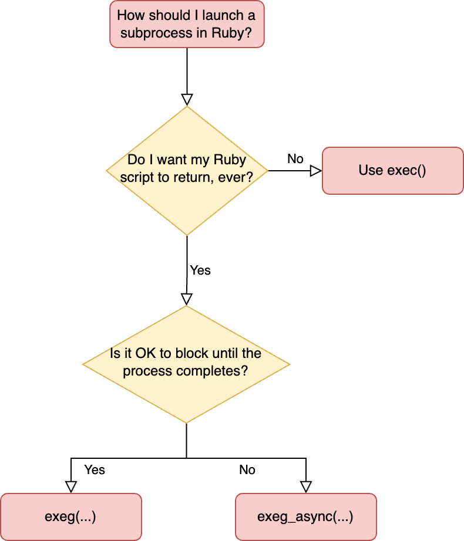

# Exeggutor 🌴

#### A Simple, Capable, and Unified Interface for Running Subprocesses in Ruby

Tired of juggling between `system(...)`, `` `...` ``, and `Open3`? Exeggutor provides one simple method that a handles many different use cases - safely spawn processes with real-time output, captured stdout/stderr, and sane error handling.

```ruby
# Copy old_file to #{new_dir}/foo, and raise an exception if it fails
exeg(%W[cp #{old_file} #{new_dir}/foo]) # Exception raised by default on failure

# Collect stdout from a long-running build task while showing the progress updates as they're
# printed out to stderr
output = exeg(%W[run_build.sh], show_stderr: true).stdout

# Async execution
handle = exeg_async(%W[long_running_process.sh])
handle.on_stdout do |line|
  puts "new line from stdout: #{line}"
end
```

From this:


To this:



#### Overview

Although Ruby has many different ways of running a subprocess, they all have various drawbacks and quirks. Also, some of the most convenient ways of calling a process, e.g. with backticks, are the most dangerous, because they spawn a subshell. Here's an overview of how Exeggutor solves these shortcomings:

|Problem with Standard Ruby APIs|Exeggutor Solution|
|-|-|
|Subshells are slow to spawn, error-prone, and insecure | Exeggutor ever uses a subshell and always runs processes directly|
|Non-subshells use ugly varargs syntax (e.g. `system('cp', old, "#{new}/foo")`)        |Exeggutor encourages elegant %W syntax by taking an array for the arguments parameter (e.g. `exeg(%W[cp #{old} #{new}/foo])`)|
|Process failures are silent, requiring manual checks|Exeggutor raises an exception on failure by default (with rich error context)|
|No simple way to both capture stdout/stderr as strings afterwards and also print them to the shell in real-time |Exeggutor always captures stdout/stderr, and can optionally print them in real-time|
|Different APIs for different use cases|Exeggutor consists of a single method with smart defaults and many optional named parameters|

#### Installation

```
gem install exeggutor
```

#### Documentation

Docs are available [here](https://www.rubydoc.info/gems/exeggutor/Exeggutor#exeg-class_method).

#### Future directions

Exeggutor is based on my own experiences, which typically involve blocking calls whose failure would prevent the program continuing any further. However, there are many other use cases, such as running shell commands in the REPL (where backticks still shine), non-blocking calls, subshells, and making the subprocess think it's in a TTY. All of these are achievable under the same (or maybe one additional) method, if the demand is there.
