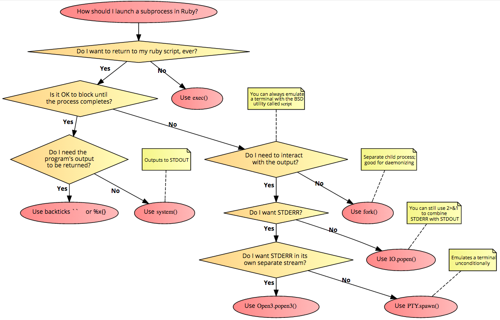

# Exeggutor 🌴

#### A Simple, Capable, and Unified Interface for Managing Subprocesses in Ruby

Tired of juggling between `system(...)`, `` `...` ``, and `Open3`? Exeggutor provides one simple method that handles many different use cases - safely spawn processes with real-time output, captured stdout/stderr, and sane error handling.

From this:



To this:


#### Examples

```ruby
# Copy old_file to #{new_dir}/foo, and raise an exception if it fails
exeg(%W[cp #{old_file} #{new_dir}/foo]) # Exception raised by default on failure

# Collect stdout from a long-running build task while showing the progress updates as they're
# printed out to stderr
output = exeg(%W[run_build.sh], show_stderr: true).stdout

# Lots of overrides
result = exeg(
  %W[foo bar],
  env: {SOME_OVERRIDE: "1"}, # Override env vars
  chdir: "/path/to/...", # Run the process in a different working directory
  can_fail: true, # Don't throw an exception, handle the error manually or ignore
  stdin: "foo", # Send this data to stdin as soon as the process starts
)

# Async execution - like popen3, but without its deadlock issue
handle = exeg_async(%W[long_running_process.sh])
handle.stdin.write("request")
response = handle.stdout.gets
```

#### Overview

Although Ruby has many different ways of running a subprocess, they all have various drawbacks and quirks. Also, some of the most convenient ways of calling a process, e.g. with backticks, are the most dangerous, because they spawn a subshell. Here's an overview of how Exeggutor solves these shortcomings:

|Problem with Standard Ruby APIs|Exeggutor Solution|
|-|-|
|Subshells are slow to spawn, error-prone, and insecure | Exeggutor ever uses a subshell and always runs processes directly|
|Non-subshells use ugly varargs syntax (e.g. `system('cp', old, "#{new}/foo")`)        |Exeggutor encourages elegant %W syntax by taking an array for the arguments parameter (e.g. `exeg(%W[cp #{old} #{new}/foo])`)|
|Process failures are silent, requiring manual checks|Exeggutor raises an exception on failure by default (with rich error context)|
|No simple way to both capture stdout/stderr as strings afterwards and also print them to the shell in real-time |Exeggutor always captures stdout/stderr, and can optionally print them in real-time|
|Different APIs for different use cases|Exeggutor consists of just one method for blocking calls, and one for non-blocking, with smart defaults and many optional named parameters|

#### Installation

```
gem install exeggutor
```

#### Documentation

Docs are available [here](https://www.rubydoc.info/gems/exeggutor/toplevel).
